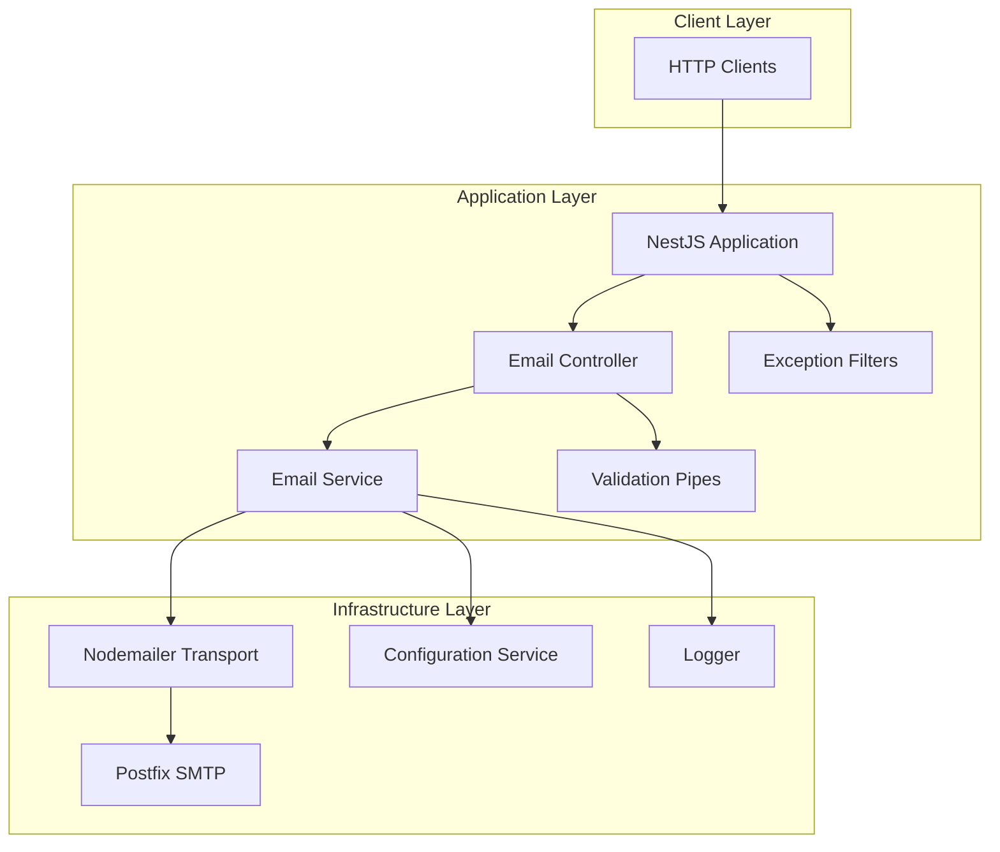

# NestJS Email Service

A robust, production-ready email service built with NestJS and Postfix SMTP. Provides REST API endpoints for sending single emails, bulk emails, and test emails with comprehensive logging and error handling.

## 🚀 Features

- **Single Email Sending** - Send individual emails with HTML/text content
- **Bulk Email Operations** - Send emails to multiple recipients with configurable delays
- **Test Email Functionality** - Send formatted test emails for configuration verification
- **SMTP Connection Management** - Connection pooling and health verification
- **API Documentation** - Auto-generated Swagger/OpenAPI documentation
- **Request Validation** - Comprehensive input validation using class-validator
- **Error Handling** - Structured error responses with detailed logging
- **Environment Configuration** - Flexible SMTP configuration via environment variables

## 📋 Prerequisites

- Node.js 18+
- Postfix SMTP server (configured and running)
- npm or yarn package manager

## 🛠️ Installation

1. **Clone the repository**
   ```bash
   git clone <repository-url>
   cd email-app
   ```

2. **Install dependencies**
   ```bash
   npm install
   ```

3. **Configure environment variables**
   ```bash
   cp .env.example .env
   ```

   Edit `.env` file with your SMTP configuration:
   ```env
   # SMTP Configuration
   SMTP_HOST=localhost
   SMTP_PORT=25
   SMTP_SECURE=false
   SMTP_USER=
   SMTP_PASSWORD=

   # Application
   PORT=3000
   NODE_ENV=production
   FROM_EMAIL=noreply@yourdomain.com
   FROM_NAME=Email Service
   ```

4. **Start the application**
   ```bash
   # Development mode
   npm run start:dev

   # Production mode
   npm run build
   npm run start:prod
   ```

## 📚 API Documentation

Once the application is running, visit:
- **Swagger UI**: `http://localhost:3000/api`
- **API Base URL**: `http://localhost:3000`

## 🔗 API Endpoints

### Health Check
```http
GET /email/status
```
Returns SMTP connection status and configuration information.

### Send Single Email
```http
POST /email/send
Content-Type: application/json

{
  "to": "user@example.com",
  "subject": "Test Email",
  "html": "<h1>Hello</h1><p>This is a test email</p>",
  "text": "Hello, this is a test email",
  "fromName": "Custom Sender Name"
}
```

### Send Bulk Emails
```http
POST /email/send-bulk
Content-Type: application/json

{
  "to": ["user1@example.com", "user2@example.com"],
  "subject": "Bulk Email",
  "html": "<h1>Bulk Email</h1><p>Content for all recipients</p>",
  "text": "Bulk email content",
  "delay": 1000
}
```

### Send Test Email
```http
POST /email/test
Content-Type: application/json

{
  "to": "test@example.com"
}
```

## 🏗️ Architecture



## 🔧 Configuration

### Environment Variables

| Variable | Description | Default | Required |
|----------|-------------|---------|----------|
| `SMTP_HOST` | SMTP server hostname | `localhost` | No |
| `SMTP_PORT` | SMTP server port | `25` | No |
| `SMTP_SECURE` | Use TLS/SSL | `false` | No |
| `SMTP_USER` | SMTP username | - | No |
| `SMTP_PASSWORD` | SMTP password | - | No |
| `PORT` | Application port | `3000` | No |
| `FROM_EMAIL` | Default sender email | - | Yes |
| `FROM_NAME` | Default sender name | - | Yes |
| `NODE_ENV` | Environment | `development` | No |

### SMTP Connection Pooling

The service uses connection pooling for optimal performance:
- **Max Connections**: 5
- **Max Messages per Connection**: 100
- **Connection Reuse**: Enabled

## 📝 Request/Response Examples

### Successful Email Response
```json
{
  "status": "success",
  "message": "Email sent successfully",
  "data": {
    "success": true,
    "messageId": "<message-id@domain.com>",
    "recipient": "user@example.com",
    "accepted": ["user@example.com"],
    "rejected": []
  }
}
```

### Bulk Email Response
```json
{
  "status": "success",
  "message": "Bulk email process completed",
  "data": {
    "total": 2,
    "successful": 2,
    "failed": 0,
    "results": [
      {
        "success": true,
        "messageId": "<message-id-1@domain.com>",
        "recipient": "user1@example.com"
      },
      {
        "success": true,
        "messageId": "<message-id-2@domain.com>",
        "recipient": "user2@example.com"
      }
    ]
  }
}
```

### Error Response
```json
{
  "status": "error",
  "message": "Failed to send email",
  "error": "SMTP connection failed"
}
```

## 🚦 Development

### Available Scripts

```bash
# Start development server with hot reload
npm run start:dev

# Build the application
npm run build

# Start production server
npm run start:prod

# Start with NestJS CLI
npm run start
```

### Project Structure

```
src/
├── main.ts                    # Application bootstrap
├── app.module.ts             # Root module
└── email/
    ├── email.module.ts       # Email module
    ├── email.controller.ts   # REST endpoints
    ├── email.service.ts      # Business logic
    └── dto/
        └── send-email.dto.ts # Data transfer objects
```

## 🔍 Monitoring & Logging

The service provides comprehensive logging:
- **Connection Status**: SMTP connection verification logs
- **Email Delivery**: Success/failure logs with message IDs
- **Bulk Operations**: Progress tracking for bulk sends
- **Error Details**: Detailed error information for debugging

Log levels and formats can be configured through NestJS Logger.

## 🛡️ Security Considerations

- **Input Validation**: All requests validated using class-validator
- **Environment Variables**: Sensitive credentials stored in environment
- **Error Handling**: Detailed errors logged but sanitized for API responses
- **CORS**: Cross-origin requests enabled (configure as needed)

## 🚀 Deployment

### Docker Deployment (Optional)
Create a `Dockerfile`:
```dockerfile
FROM node:18-alpine
WORKDIR /app
COPY package*.json ./
RUN npm ci --only=production
COPY dist ./dist
EXPOSE 3000
CMD ["node", "dist/main"]
```

### PM2 Deployment
The project includes `ecosystem.config.js` for PM2 process management:
```bash
pm2 start ecosystem.config.js
```

## 🤝 Contributing

1. Fork the repository
2. Create a feature branch
3. Make your changes
4. Add tests if applicable
5. Submit a pull request

## 📄 License

This project is licensed under the MIT License.

## 🆘 Support

For support and questions:
- Check the [API documentation](http://localhost:3000/api)
- Review the logs for error details
- Verify SMTP server configuration
- Test with the `/email/test` endpoint

## 🔄 Version History

- **1.0.0** - Initial release with core email functionality